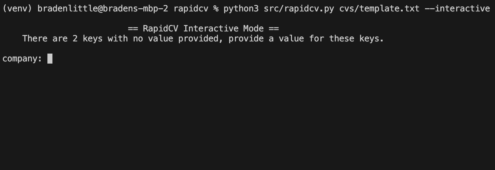
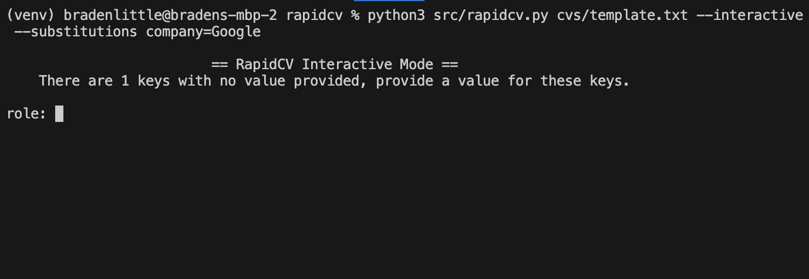

# rapidcv

A small Python utility that makes rapidly customizing cover letters easier.

Embed keys in your CV template and replace them with customizable values via the command line.

## Install

1. Make sure you have Python 3.7 or greater installed.
2. Clone the repo `git clone https://github.com/Madrugaur/rapidcv.git`
3. Go into the project directory `cd rapidcv`
4. (Recommended) Set up a `venv` `python3 -m venv venv`
5. Install dependencies `pip install -r requirements.txt`

## Usage

RapidCV provides two CLI modes: interactive and non-interactive, and support for a Firefox extension. In both of the CLI modes, key-values pairs are provided by you and are used to replaced the keys in the provided template file.

See the Extension section for more details.

For example if you were writing a CV for a software engineering position at Google, your key-value substitution pairs might look like this:

```
company=Google
role="Software Engineer"
```

and your template might look like:

```
Dear Hiring Manager,

I am applying for the role of {{role}} at {{company}}. I believe I am qualified for this role because ... etc etc
```

The output of the tool in the above scenario would be:

```
Dear Hiring Manager,

I am applying for the role of Software Engineer at Google. I believe I am qualified for this role because ... etc etc
```

The tool is completely agnostic to what keys you decided to use, but keys must only contains what regex considers "word characters": `[a-zA-Z0-9_]`

### Interactive Mode

In interactive mode, all you need to provide to the tool is a path to the template file and the interactive flag.

`python src/rapidcv.py <template_path> --interactive`

The application will go scan the template file for keys and then prompt you to give a value for each one.



You can also provide values for some or all of the keys using the CLI.



### Non-interactive Mode

In non-interactive mode, all key-value pairs have to be provided in the CLI. If there is a key in the template that is not provided a value in the CLI, it will not get replaced.

`python src/rapidcv.py <template_path> --substitutions company=Google role="Software Engineer"`

## Extension

TODO

## Support

### File Types

Currently this tool only supports doing substitutions on plain text files and Microsoft Docx files. Extending functionality to handle other file types will happen as requested.

### Operating Systems

This tool has only been tested for macOS, but there shouldn't be anything platform specific required.
